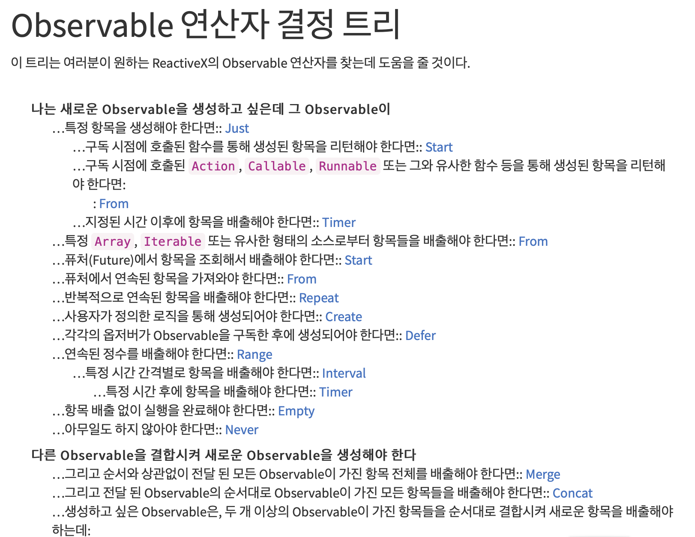

# 03_Operators

​        

### - What is Operators?

Operator는 **연산자** 라고 할 수 있다. Operator는 **Observable에서 받은 이벤트를 변환하고 처리** 할 수 있도록 해준다.

Operator에는 많은 종류가 있기 때문에 이 모두를 알 순 없고, [ReactiveX](http://reactivex.io/documentation/ko/operators.html#tree) 홈페이지에 있는 연산자 결정 트리를 보며 필요한 Operator를 찾아서 사용하는 것이 일반적이다.

가장 많이 사용되는 몇개의 Operator의 예제만 다뤄볼 것이다.

​         

------

​          

### - Create

직접적인 코드 구현을 통해 옵저버 메서드를 호출하여 **Observable을 생성** 하는 Operator.

Observable 생성 시 가장 많이 사용되는 Operator 중 하나 이다.

~~~swift
let source : Observable = Observable.create { observer in
    for i in 1...5 {
        observer.on(.next(i))
    }
    observer.on(.completed)
    return Disposables.create {
        print("disposed")
    }
}
~~~

create는 escaping 클로저로 AnyObserver를 취한 뒤, Disposable을 return한다.

​       

------

​       

### - Just

객체 하나 또는 객채집합을 **Observable로 변환** 한다. 변환된 Observable은 원본 객체들을 발행한다.

**하나의 이벤트만 발생** 하고 종료된다.

파라미터로 주어진 Item을 Observable로 발행한다. 

~~~swift
Observable<String>.just("just one")
~~~

​       

------

​       

### - Map

Observable이 배출한 항목에 함수를 적용한다.

~~~swift
Observable<String>.just("다은")
	.map{"정\($0)"}
~~~

​       

------

​         

### - FlatMap

하나의 Observable이 발행하는 항목들을 여러개의 Observable로 변환하고, 항목들의 배출을 차례차례 줄 세워 하나의 Observable로 전달한다.

~~~swift
Observable<String>.just("다은")
	.flatMap{ Observable<String>.just("정\($0)") }
~~~

​     

- #### map과 flatMap의 차이점?

  map과 flatMap 둘 다 데이터를 가공하기 위해 사용하는 함수이다.

  map은 단순하게 함수로 받은 **데이터를 데이터로** 만 가공하는 것이고,

  flatMap은 함수로 받은 **데이터를 Observable로 return** 하여 유연성을 가진다는 것이다.

​       

------

​         

### - Filter

조건을 만족하는 항목들만 배출한다.

~~~swift
Observable.just(1,2,3,4,5)
	.filter{ $0 < 4 }
~~~

​      

------

​      

### - Merge

복수 개의 Observable들이 배출하는 항목들을 머지시켜 하나의 Observable로 만든다.

~~~swift
let observable1: Observable<Integer> = Observable.just(1,3,5)
let observable2: Observable<Integer> = Observable.just(2,4,6)

Observable.of(observable1, observable2).merge()
~~~

이벤트 타입이 같지 않으면 merge할 수 없다.

​      

------

​        

### - CombineLatest

두 개의 Observable 중 하나가 항목을 배출할 때 배출된 마지막 항목과 다른 한 Observable이 배출한 항목을 결합한 후 함수를 적용하여 실행 후 실행된 결과를 배출한다.

~~~swift
let observable1 = Observable.just("Hello")
let observable2 = Observable.just("Danny")

let observable = Observable.combineLatest(observable1, observable2, resultSelector: { 
         "\($0) \($1)"
})
~~~

​        

- #### CombineLatest는 언제 사용될까?

  Id와 Pw를 받는 TextField가 있을 때, 두개가 모두 입력이 되면 로그인 버튼을 활성화시킬 수 있다.

​            

------

​          

### - Subscribe

Observable이 배출하는 항목과 알림을 기반으로 동작한다

~~~swift
Observable.just(1,2,3)
  .subscribe { event in
    switch event {
    case .next(let value):
      print(value)
    case .error(let error):
      print(error)
    case .completed:
      print("completed")
    }
  }
  .disposed(by: self.disposeBag)
~~~

Observable은 sequence를 정의할 뿐, subscribe되기 전에는 어떤 이벤트도 보내지 않는다.

subscribe 메서드는 Disposable을 리턴한다.

각각의 요소들에 대해서 .next 이벤트를 방출하고 최종적으로 .completed를 방출한다.

​         

------

​           

### - Concat

두 개 이상의 Observable들이 항목을 발행할 때 Observable 순서대로 배출하는 항목들을 하나의 Observable 배출로 연이어 배출한다

~~~swift
let observable1 = Observable.from(["Hello","Hi"])
let observable2 = Observable.from(["Daeun","Danny"])
observable1.concat(observable2)
~~~

​        

------

​         

### - 연산자 결정 트리

[ReactiveX](http://reactivex.io/documentation/ko/operators.html) 공식 홈페이지에선 Operator 결정 트리를 제공해주고 있다.

모든 Operator들을 다 알고 있을 순 없기 때문에 이 결정 트리를 보며 사용해야할 Operator를 골라 사용하는 것을 추천한다.

